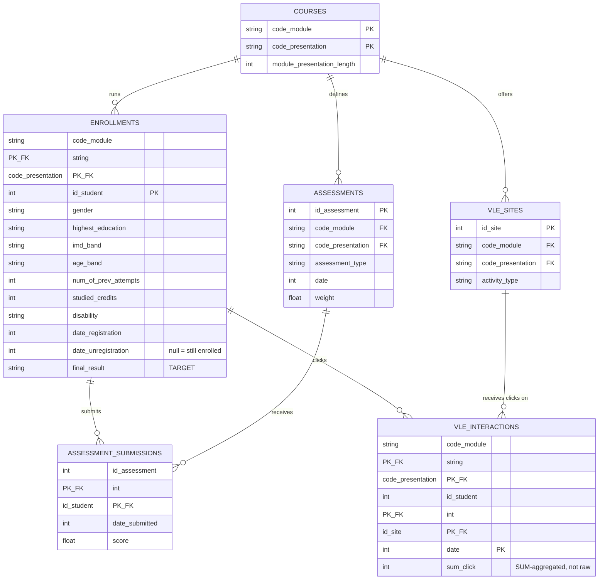

# Dataset Inspection: OULAD (`data/raw/oulad/`)

Inspection date: 2026-08-04. Findings below are from a full read-only profiling
pass over all 7 files (row counts, null counts, duplicate-row checks, key
uniqueness, referential integrity across files) — not a 3-row sample guess.
No cleaning, transformation, or code was produced as part of this pass; see
[docs/DATASETS.md](../DATASETS.md) for the original dataset-selection research
and DECISIONS.md ADR-008 for why OULAD was chosen as the project's spine
dataset.

Relational shape (composite key `(code_module, code_presentation, id_student)`
is the backbone linking most tables):

```
courses.csv ──┐
              ├─(code_module, code_presentation)─► studentInfo.csv ─(id_student)─► studentRegistration.csv
vle.csv ──────┤                                         │
              │                                         └─(composite key)──► studentVle.csv ──(id_site)──► vle.csv
assessments.csv ─(id_assessment)─► studentAssessment.csv ──(id_student, via assessments)──► studentInfo.csv
```

---

## 1. courses.csv

- **Contents:** one row per course presentation (a specific run of a module) with its total length in days. 22 rows, 3 columns: `code_module`, `code_presentation`, `module_presentation_length`.
- **Classification:** **Optional**
- **Why:** pure reference/dimension data — no student-level signal. Useful for normalizing time-based fields elsewhere (e.g., converting `date_registration` or VLE click dates into "% through the course" so a 234-day and a 269-day presentation are comparable), but the system can function without it (fixed-length assumption as a fallback).
- **Primary key:** composite `(code_module, code_presentation)`.
- **Target variable:** none — reference table.
- **Columns to keep:** all 3 — the table is tiny and every column is load-bearing for the one thing it's used for.
- **Columns to ignore:** none.
- **Relationships:** joins to `studentInfo`, `studentRegistration`, `assessments`, `vle` on `(code_module, code_presentation)`.
- **Data quality:** clean — 0 nulls, 0 duplicate rows, all 22 module/presentation combinations present.
- **Modules used by:** Classroom Digital Twin (course/term structure), Learning Analytics (time normalization support).

---

## 2. studentRegistration.csv

- **Contents:** one row per student enrollment in a course presentation: registration date and (if applicable) unregistration date, both measured in days relative to course start (day 0). 32,593 rows, 5 columns.
- **Classification:** **Essential**
- **Why:** this is the ground-truth timing signal for withdrawal — `date_unregistration` tells you not just *whether* a student dropped out but *when*, which `studentInfo.final_result = "Withdrawn"` alone does not. Critical for any dropout-risk model that needs to simulate "what did we know about this student N days into the course."
- **Primary key:** composite `(code_module, code_presentation, id_student)` — confirmed unique, 0 duplicates.
- **Target variable:** none directly, but `date_unregistration` (non-null ⇒ withdrew, value = day of withdrawal) is effectively a **derived dropout-timing label**, complementary to `studentInfo.final_result`.
- **Columns to keep:** all 5.
- **Columns to ignore:** none.
- **Relationships:** joins to `studentInfo` on the same composite key (verified: the two tables cover the exact same set of 32,593 enrollment records, no orphans either direction).
- **Data quality:**
  - `date_registration`: 45 nulls (0.14%).
  - `date_unregistration`: 22,521 nulls (69%) — **this is structurally meaningful, not missing data**: null means the student did not withdraw (stayed enrolled through `final_result`). Do not impute or drop rows on this basis.
  - `date_registration` ranges from **-322 to 167** (days relative to course start) — large negative values (registered nearly a year early) and positive values (registered after the course technically started) are both real, documented OULAD behavior, not outliers to clip.
  - **Identifier caveat:** `id_student` is **not** globally unique in this file — 28,785 unique students across 32,593 rows, meaning 3,538 students appear more than once (enrolled in multiple module presentations). Any Student Digital Twin keyed only on `id_student` must account for this — either build one twin per `(id_student, code_module, code_presentation)` enrollment, or aggregate a student's multiple enrollments into one twin explicitly.
- **Modules used by:** Student Digital Twin (enrollment/withdrawal timeline), Performance Prediction (dropout timing), Teacher Decision Support (early-warning windows).

---

## 3. studentInfo.csv

- **Contents:** one row per student enrollment: demographics, prior academic history, and the final outcome. 32,593 rows, 12 columns.
- **Classification:** **Essential**
- **Why:** this is the core profile-plus-outcome table — it holds the project's primary target variable and the demographic features most models will condition on.
- **Primary key:** composite `(code_module, code_presentation, id_student)` — confirmed unique, 0 duplicates. (Same `id_student`-reuse caveat as studentRegistration applies here.)
- **Target variable:** **`final_result`** — categorical: `Pass` (12,361), `Withdrawn` (10,156), `Fail` (7,052), `Distinction` (3,024). This is the primary Performance Prediction / Dropout Risk target for the whole dataset. Note the class imbalance (Distinction is only ~9% of rows) — worth flagging now for whoever designs the eventual model, even though no modeling is happening yet.
- **Columns to keep:** `id_student`, `code_module`, `code_presentation` (keys); `gender`, `highest_education`, `imd_band`, `age_band`, `num_of_prev_attempts`, `studied_credits`, `disability` (predictive features); `final_result` (target).
- **Columns to ignore:** **`region`** — UK-specific geography (13 English/Scottish/Welsh/Irish regions) with no analog in a generic classroom twin; low reuse value outside this exact dataset. Recommend dropping or keeping only for exploratory analysis, not as a model feature.
- **Relationships:** joins to `studentRegistration` on the full composite key (verified 1:1, no orphans). Joins to `studentAssessment` indirectly via `assessments.csv` (see below) and to `studentVle` directly on the composite key.
- **Data quality:**
  - `imd_band` (Index of Multiple Deprivation band — a UK socioeconomic proxy): **1,111 nulls (3.4%)**. This is the only column with missingness in this file.
  - **Inconsistent category formatting:** `imd_band` values are mostly `"XX-XX%"` (e.g. `"90-100%"`) but one category is `"10-20"` **without the trailing `%`** — a labeling inconsistency that would silently break naive string-based ordinal encoding if not caught.
  - 0 duplicate rows.
- **Modules used by:** Student Digital Twin (profile), Performance Prediction (target), Learning Analytics, Teacher Decision Support.

---

## 4. assessments.csv

- **Contents:** one row per assessment offered in a course presentation — its type, due date, and weight toward the final grade. 206 rows, 6 columns.
- **Classification:** **Essential**
- **Why:** `studentAssessment.csv` (below) gives raw scores with no context; this table is what makes those scores interpretable — without it you can't tell a 20%-weighted TMA from a 100%-weighted final Exam, or compute lateness.
- **Primary key:** `id_assessment` — confirmed globally unique across the whole dataset (not just per presentation).
- **Target variable:** none — reference table.
- **Columns to keep:** all 6.
- **Columns to ignore:** none.
- **Relationships:** joins to `courses`/`studentInfo` on `(code_module, code_presentation)`; joins to `studentAssessment` on `id_assessment`. **This is also the required join path to attach `code_module`/`code_presentation` to `studentAssessment` rows**, since `studentAssessment.csv` itself does not carry those columns.
- **Data quality:**
  - `date` (days from course start the assessment is due): **11 nulls (5.3%)** — all 11 are `assessment_type = "Exam"` rows. This is documented OULAD behavior (final exam dates are frequently withheld/variable) rather than a data error; do not treat as missing-at-random.
  - `assessment_type` breakdown: TMA (Tutor-Marked Assessment) 106, CMA (Computer-Marked Assessment) 76, Exam 24.
  - 0 duplicate rows.
- **Modules used by:** Performance Prediction, Learning Analytics.

---

## 5. studentAssessment.csv

- **Contents:** one row per student per assessment attempt — score achieved and submission date. 173,912 rows, 5 columns.
- **Classification:** **Essential**
- **Why:** the most granular, time-resolved performance signal in the dataset — each row is an opportunity to update a Student Digital Twin's knowledge-state estimate, and in aggregate these are what `final_result` is ultimately derived from.
- **Primary key:** composite `(id_assessment, id_student)` — confirmed unique, 0 duplicates.
- **Target variable:** none directly, but `score` (0–100) is a strong **auxiliary/intermediate target** — useful for early-warning models that predict final outcome from early-assessment performance, before `final_result` is known.
- **Columns to keep:** `id_assessment`, `id_student`, `date_submitted`, `score`.
- **Columns to ignore:** **`is_banked`** (binary flag, only 1,909 of 173,912 rows = 1.1% set) — marks results carried over administratively from a student's *previous* presentation attempt rather than newly earned in this one. Low general utility; if kept at all, treat as a data-provenance flag rather than a model feature (a "banked" score doesn't reflect current-presentation effort, so blending it into a knowledge-state update without this flag would be misleading).
- **Relationships:** `id_assessment` → `assessments.csv` (verified: every `id_assessment` value in this file exists in `assessments.csv`, no orphans) → gives `code_module`/`code_presentation` → combine with `id_student` to join to `studentInfo`/`studentRegistration`.
- **Data quality:**
  - `score`: **173 nulls (0.1%)** — a genuinely missing/ungraded submission, not a structural null like the ones seen above.
  - 0 duplicate rows.
- **Modules used by:** Student Digital Twin (knowledge-state updates), Performance Prediction, Personalized Learning (per-assessment weak points).

---

## 6. vle.csv

- **Contents:** one row per VLE (Virtual Learning Environment) site/resource offered in a course presentation, with its activity type and, for some, the week range it's active. 6,364 rows, 6 columns.
- **Classification:** **Optional**
- **Why:** it's a lookup table for *what kind* of resource a click in `studentVle.csv` was on (e.g. `resource`, `oucontent`, `forumng`, `quiz`). `studentVle.csv` is usable on its own for raw click-volume signal; this table only adds resource-type breakdown, which enriches Engagement Analysis but isn't required for a first-pass engagement model.
- **Primary key:** `id_site` — confirmed globally unique across the whole dataset.
- **Target variable:** none — reference table.
- **Columns to keep:** `id_site`, `code_module`, `code_presentation`, `activity_type`.
- **Columns to ignore:** `week_from`, `week_to` — **5,243 of 6,364 rows (82%) are null** for both; only a minority of resources have a defined active week-range, so these columns are too sparse to rely on as a general feature.
- **Relationships:** joins to `studentVle` on `id_site` (verified: every `id_site` in `studentVle.csv` exists here, no orphans); joins to `courses`/`studentInfo` on `(code_module, code_presentation)`.
- **Data quality:** 0 nulls on the 4 core columns, 0 duplicate rows; missingness is isolated entirely to `week_from`/`week_to`.
- **Modules used by:** Classroom Digital Twin (available resource inventory), Engagement Analysis (activity-type taxonomy).

---

## 7. studentVle.csv

- **Contents:** the clickstream — one row per student, per VLE site, per day, with the number of clicks that day. 10,655,280 rows, 6 columns. By far the largest file in the dataset (433MB).
- **Classification:** **Essential**
- **Why:** this is the primary engagement signal in OULAD and a major reason it was selected as the project's spine dataset (ADR-008) — it's the only table with day-level behavioral resolution rather than a single end-of-course outcome.
- **Primary key:** **none, as distributed — this is the dataset's main data-quality issue.** See below.
- **Target variable:** none directly; `sum_click` (aggregated appropriately, see quality note) is the core engagement feature feeding Engagement Analysis and the Student Digital Twin's activity history.
- **Columns to keep:** all 6 — `code_module`, `code_presentation`, `id_student`, `id_site`, `date`, `sum_click`.
- **Columns to ignore:** none.
- **Relationships:** already carries the full `(code_module, code_presentation, id_student)` composite key directly (verified: every combination present here also exists in `studentInfo.csv`, no orphans), plus `id_site` → `vle.csv` (verified: every `id_site` here exists in `vle.csv`, no orphans).
- **Data quality — the most important finding in this dataset:**
  - **787,170 fully-duplicate rows** (7.4% of all rows) — identical across every column including `sum_click`.
  - More significantly: **2,195,960 rows (20.6%) share the same key** `(code_module, code_presentation, id_student, id_site, date)` **with a *different* `sum_click` value.** Example: student 11391, site 546644, day 222 appears as both `sum_click=5` and `sum_click=11` in separate rows.
  - **This means the file is not pre-aggregated to one row per student/site/day as its own column semantics imply** — despite `sum_click` being named as if it's already a daily total. Getting a correct "total clicks by this student on this site on this day" requires summing `sum_click` grouped by the 5-column key first. Treating raw rows as already-aggregated (e.g. naively averaging or sampling one row per key) would silently undercount engagement for roughly a fifth of the data.
  - This is worth flagging clearly before any preprocessing decision is made, since it changes how the aggregation step must be written.
- **Modules used by:** Student Digital Twin (engagement history — primary source), Classroom Digital Twin (aggregate classroom-level engagement), Engagement Analysis (primary source), Learning Analytics.

---

## Recommended preprocessing/integration order for OULAD's 7 files

1. **`courses.csv`** — smallest, no dependencies, needed first for time normalization used by everything downstream.
2. **`vle.csv`** — reference table, needed before `studentVle.csv` if activity-type enrichment is wanted.
3. **`assessments.csv`** — reference table, needed before `studentAssessment.csv` to attach course/weight/type context.
4. **`studentInfo.csv`** — the core entity + target table; establishes the set of valid `(code_module, code_presentation, id_student)` keys everything else joins against.
5. **`studentRegistration.csv`** — joins directly onto `studentInfo`'s key set; adds withdrawal timing.
6. **`studentAssessment.csv`** — transactional; join through `assessments.csv` to attach course context, then to `studentInfo`.
7. **`studentVle.csv`** — process last: largest file, and requires resolving the duplicate-key aggregation issue above before it can be trusted as a per-day click count.

---

## Summary

- **Essential files:** `studentInfo.csv`, `studentRegistration.csv`, `assessments.csv`, `studentAssessment.csv`, `studentVle.csv` (5 of 7)
- **Optional files:** `courses.csv`, `vle.csv` (2 of 7) — both are small reference/lookup tables that enrich but aren't required for a first working pipeline
- **Not needed:** none — every file in this dataset earns its place
- **Primary target variable:** `studentInfo.final_result` (Pass/Fail/Withdrawn/Distinction); `studentRegistration.date_unregistration` and `studentAssessment.score` serve as auxiliary/derived signals
- **Key columns to drop:** `studentInfo.region` (UK-specific, low generalizability), `vle.week_from`/`week_to` (82% null), `studentAssessment.is_banked` (niche provenance flag, keep only if explicitly needed)
- **Top concern before preprocessing:** the `studentVle.csv` duplicate-key issue (20.6% of rows share a key with a differing `sum_click`) must be resolved via group-and-sum, not naive deduplication or row sampling, or engagement volume will be undercounted.
- **Secondary concern:** `id_student` is not a unique row identifier anywhere in OULAD — 3,538 students have multiple enrollments. Decide explicitly (before modeling) whether the Student Digital Twin is keyed per-enrollment or per-person-aggregated-across-enrollments, since this affects every downstream join.

---

## Proposed final relational schema

This is a **logical target schema** — how OULAD's 7 raw files should be
consolidated into the persistence layer (`data/db/models.py` /
`data/repositories/`), not a preprocessing pipeline. No transformation is
performed here; this is a design decision to review before any table is
actually built.

The guiding rule: **merge only where two files share the same grain (one row
= the same real-world thing) and the same key set. Keep everything else
normalized and joined at read time.**

### Tables that remain fully independent (dimension/reference tables)

- **`courses`** (from `courses.csv`) — grain: one course presentation. Never merges into anything; it's referenced by key, not absorbed, because absorbing it would mean repeating `module_presentation_length` on every enrollment/assessment/site row for no benefit.
- **`assessments`** (from `assessments.csv`) — grain: one assessment definition. Stays independent for the same reason — it's shared context read by many `assessment_submissions` rows, not owned by any one of them.
- **`vle_sites`** (from `vle.csv`) — grain: one VLE resource/site. Stays independent — shared context read by many `vle_interactions` rows.

These three remain small, rarely-changing lookup tables joined in at query time by whatever needs them (`code_module`+`code_presentation`, `id_assessment`, or `id_site`).

### Tables that should be merged

- **`studentInfo` + `studentRegistration` → `enrollments`.** Justification: the previous inspection confirmed these two files share the *exact same grain* (one row = one student's presence in one course presentation) and the *exact same key set* — every `(code_module, code_presentation, id_student)` in one exists in the other, with zero orphans either direction. There is no case where a Student Digital Twin needs profile data (`studentInfo`) without timing data (`studentRegistration`) or vice versa — every read wants both. Keeping them as two physically separate tables would mean every single query pays for a trivial 1:1 join that never filters or changes cardinality. Merge into one `enrollments` table: `(code_module, code_presentation, id_student)` as composite primary key, holding demographics, `num_of_prev_attempts`, `studied_credits`, `date_registration`, `date_unregistration`, and `final_result` together.

This is the **only** merge recommended. Every other pair of files has either a different grain or a different key shape, which is precisely why they should *not* be merged (below).

### Tables that should stay normalized (explicitly not merged, despite being "about a student")

- **`assessment_submissions`** (from `studentAssessment.csv`) — grain: one student's attempt at one assessment. This is many-to-one against `enrollments` (one enrollment has many submissions over the course). Folding it into `enrollments` would force a lossy one-row-per-student summary, destroying the exact time-series signal (score progression across the term) that `twin_engine`'s incremental update logic is built to consume. Stays a normalized fact table, foreign-keyed to both `enrollments` (via `id_student` + the module/presentation reached through `assessments`) and `assessments` (via `id_assessment`).
- **`vle_interactions`** (from `studentVle.csv`) — grain: one student, one site, one day. Same reasoning, even more so — this is the highest-cardinality table by far (10.6M raw rows). Must stay a normalized event/fact table, never merged into `enrollments`. **Before it can be treated as "one row per key" it needs the group-by-sum aggregation identified in the inspection** (20.6% of raw rows share a key with a differing `sum_click`) — that aggregation happens *within* this table's own construction, it is not a merge with another table.

### Diagram



`ENROLLMENTS` is the hinge of the schema: every other student-scoped table
reaches it through `(code_module, code_presentation, id_student)`, not
`id_student` alone — required because `id_student` is reused across a
student's multiple enrollments (3,538 students in this dataset), so the
composite key is what actually identifies "this student's presence in this
specific course run."

### What the Student Digital Twin should read

One Student Digital Twin instance = one `enrollments` row (i.e., per-enrollment,
not per-person — see the identifier caveat above; a student with 2 OULAD
enrollments has 2 twins unless a separate higher-level "person" aggregation is
built on top later, which is out of scope for now):

- **`enrollments`** — its own single row, by composite key: profile + outcome.
- **`assessment_submissions`** — all rows for that `id_student` (scoped implicitly to this enrollment via the `assessments` join), ordered by `date_submitted`, joined to **`assessments`** for weight/type/due-date context — this is what feeds the twin's knowledge-state trajectory.
- **`vle_interactions`** — all rows for that `(code_module, code_presentation, id_student)`, ordered by `date`, optionally joined to **`vle_sites`** for activity-type breakdown — this is what feeds the twin's engagement history.
- **`courses`** — just the one row matching its own `(code_module, code_presentation)`, used only to normalize dates into "% through the course" rather than raw day offsets.

It does **not** need any other enrollment's data, or any classroom-level aggregate — that's the Classroom Digital Twin's job.

### What the Classroom Digital Twin should read

OULAD has no physical classroom — the closest real analog is a **course
presentation** (one `(code_module, code_presentation)` pair, e.g. `AAA-2013J`),
treated as the cohort. One Classroom Digital Twin instance = one `courses` row
plus everything scoped to that key:

- **`courses`** — its own single row (course length).
- **`enrollments`** — *all* rows sharing that `(code_module, code_presentation)` — the full roster, demographic mix, and `final_result` distribution (Pass/Fail/Withdrawn/Distinction counts) for the cohort.
- **`assessments`** — *all* rows for that presentation — the shared assessment calendar and weighting every student in this cohort is subject to.
- **`vle_sites`** — *all* rows for that presentation — the resource catalog available to this cohort.
- **`assessment_submissions`** and **`vle_interactions`**, *aggregated* (grouped) across every enrollment in that cohort — e.g. mean/median score per assessment across the class, daily click-volume trend for the whole cohort. This is the key structural difference from the Student twin: the Classroom twin reads *many* students' event rows at once and reduces them, rather than one student's rows in sequence.

This maps directly onto the existing module split in `CLAUDE.md`:
`twin_engine/student_twin.py` owns the per-enrollment read path above,
`twin_engine/classroom_twin.py` owns the per-presentation aggregate path, and
neither should reach into the other's query scope directly — `classroom_twin`
should aggregate over `student_twin` state/reads, not re-derive it separately.

### One deliberately out-of-scope note

A future **read-optimized/denormalized view** (e.g. a materialized "current
twin snapshot" table combining latest score + latest engagement + demographics
in one row per enrollment, for fast dashboard reads) is a reasonable idea, but
it is a *derived* artifact built on top of this normalized schema, not a
replacement for it — not designed here since it borders on implementation.

---

Stopping here for approval before moving to the next dataset.
